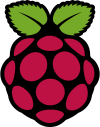

=================
Logo Attributions
=================

:date: 2015-02-16 23:41
:category: VCT
:slug: logos
:summary: Logo attributions
:save_as: pages/logos.html
:status: hidden

The Gentoo logo is a trademark of the Gentoo Foundation, Inc.

https://www.gentoo.org/main/en/name-logo.xml

The Jenkins logo is a trademark of the Jenkins CI Project 

https://wiki.jenkins-ci.org/display/JENKINS/Logo

The Tux logo was designed for Linux by Larry Ewing

http://isc.tamu.edu/~lewing/linux/

.. image:: ../images/project_logos/debian_logo.svg

The Debian logo is a trademark of the Debian Project

https://www.debian.org/logos/

The Raspberry Pi logo is a trademark of the Raspberry Pi Foundation

http://www.raspberrypi.org/trademark-rules/

The Python logo is a trademark of the Python Software Foundation

https://www.python.org/community/logos/

The git logo was designed for the git community by Jason Long

http://git-scm.com/downloads/logos
